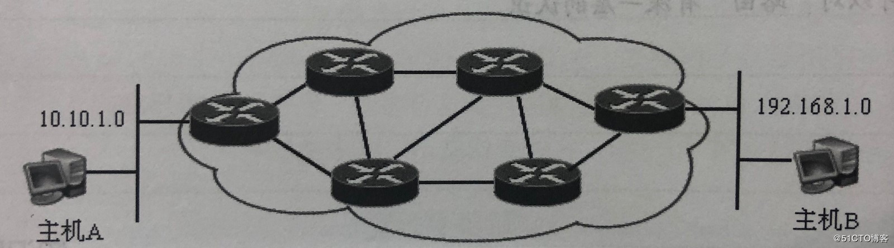
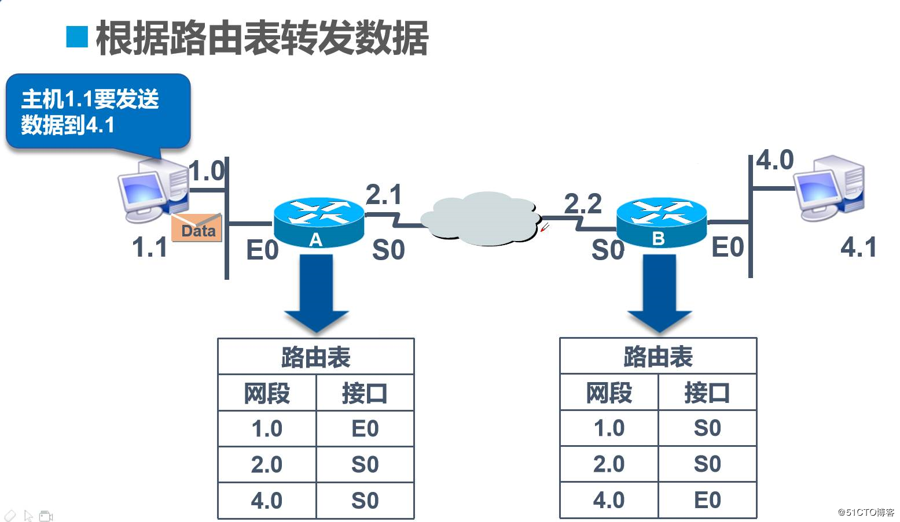
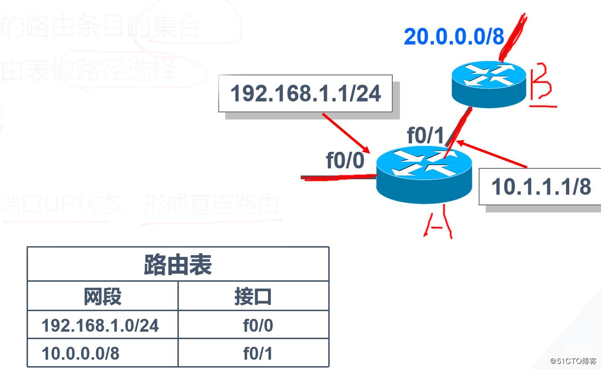
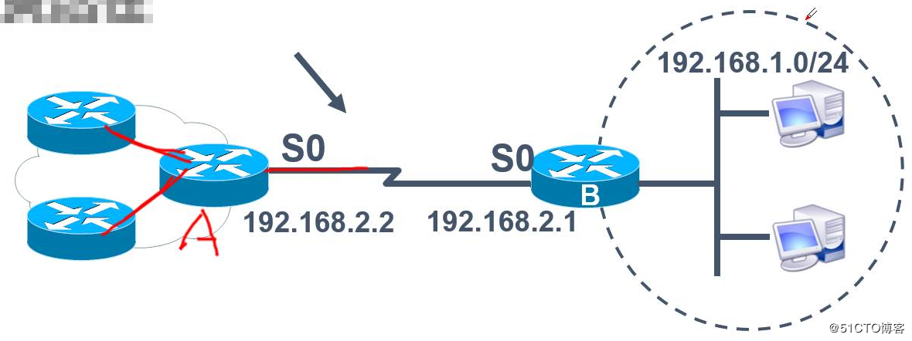
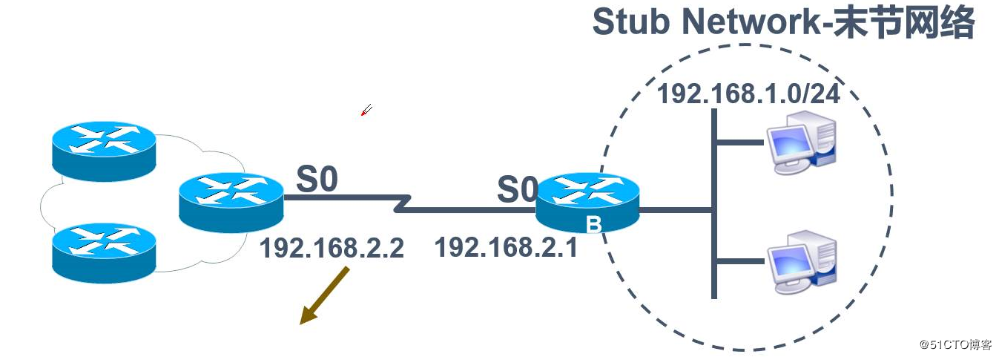
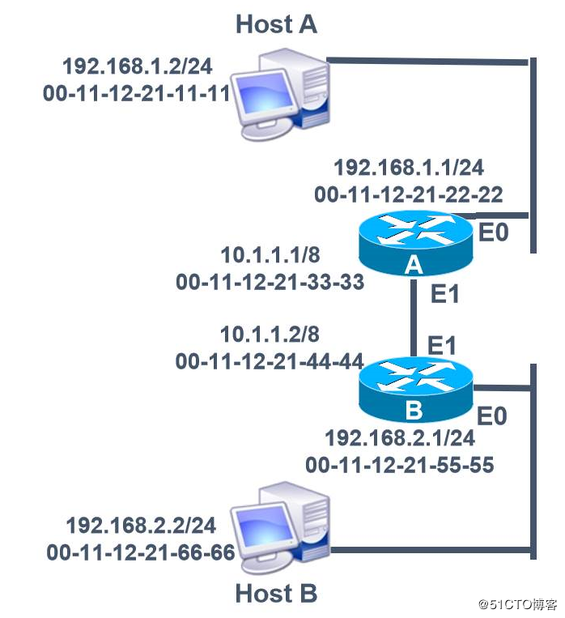
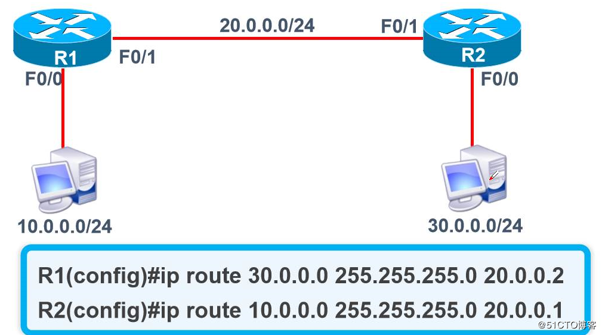
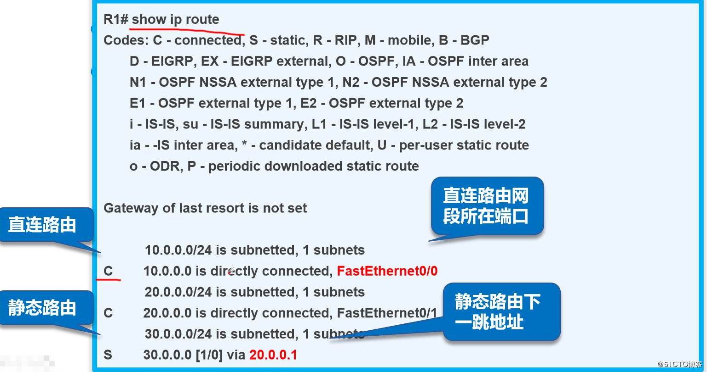
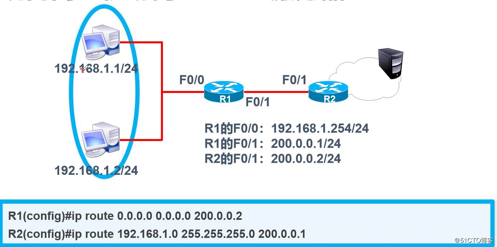

## 静态路由

# 首先我们讲讲路由的原理：

路由器工作在OSI参考模型的网络层，它的重要作用是为数据包选择最佳路径，最终送达目的地
以下图为例来说明以下路由的技术是怎么样的：

在只有一个网段的网络中，数据包可以很容易的从源主机到达目标主机。但是如果一台计算机要和非本网段的计算机通信，数据包就要经过很多路由器。如上图所示，主机A和主机B所在的网段被许多路由器隔开，这时如果两台 主机需要通信的话就要通过中间这些路由器，这时候最重要的问题就是如何选择到达目的地的路径。数据包从主机A到主机B有多条路径可供选择，但是很显然这些路径中总有一条是最好最快的。因此，**为了能够提高网络的访问速度就需要有一种方法来判断从源主机到目标主机所经过的最佳路径从而进行转发，这就是路由的技术**！

## **一.路由器的工作原理**：

根据路由表转发数据：

具体过程如下：
1.主机1.1要发送数据到主机4.1
2.Data到达路由器A，查看路由表匹配路由条目，4.0网段从S0出口出
3.Data到达路由器B，查看路由表匹配路由条目，4.0网段从E0出口出
4.主机4.1从E0端口接收到数据包
核心：传输过程中查看路由表匹配正确对应的接口

## **二.路由表的形成**：

路由表的定义：
1.路由器中维护的路由条目的集合
2.路由器根据路由表做路径选择
路由表的形成

-   直连网段：配置IP地址，端口为UP状态，形成直连路由
-   非直连网段：自己身上的是直连网段，别人身上的是非直连网段
    具体如下图：
    

## **三.静态路由：**

1.由管理员手工配置的，是单向的
2.缺乏灵活性
综上所述：静态路由用于网络规模不大、拓扑结构相对固定的网络中

如上图所示：如果路由器A需要将数据发送到非直连网段192.168.1.0，就需要在路由器A上添加静态路由

## **四.默认路由：**

当路由器在路由表中找不到目标网络的路由条目时，路由器把请求转发到默认路由接口（例如我们在网页无法连接时会跳转到404页面）

如上图所示：路由器B右侧的192.168.1.0位末梢网络，这个网络中的主机要访问其他网络必须要通过路由器B和路由器A，没有第二条路径，这样就可以在路由器B上配置一条默认路由。只要是192.168.1.0中的主机要访问其他网络，这样的数据包发送到路由器B之后，路由器B就会按照默认路由来转发（转发到路由器A的S0接口），而不管该数据包的目的地址到底是哪个网络
综上对于静态和动态路由的描述得到如下结论：**静态路由优先级高于默认路由**！

**五.路由器转发数据包的分装过程：**
首先我们大体了解一下：

-   路由器上两个接口分别是两个不同网段
-   路由器连接交换机，交换机连接多台PC机
-   路由器的两个不同的端口出去到交换机的就为两个不同的广播域
-   路由器起到物理隔绝广播的设备
-   此时一个广播域发生广播，另一个广播域是收不到的
    
    下面我们就上图进行详细说明：
    1.  首先我们要清楚的是源IP是HOST A的192.168.1.2，目标IP是HOST B的192.168.2.2
    2.  此时HOST A会发出ARP广播，到达E0口，到达之后网关会对其进行解析，解析完成之后会回馈自己的MAC地址给HOST A
    3.  接下来此处为第一次封装：HOST A在接到回馈之后将自己的 00-11-12-21-11-11作为源MAC，将A的回馈00-11-12-21-22-22作为目标MAC发送至A的E0端口
    4.  路由器A从E0收到数据包之后检查目标MAC是否为自己，确认此数据包是要通过自己的路由转发，所以路由器A会查找自己的路由表，寻找与目标192.168.2.2相匹配的路由表项，然后根据路由表的下一跳地址将数据包转发到E1接口
    5.  在E1接口路由器A重新封装，此时源MAC地址为E1接口的00-11-12-21-33-33，目标MAC地址为与之相连的路由器B的E1接口的00-11-12-21-44-44
    6.  路由器B从E1接口接收到数据帧之后同样会把数据链路层的封装去掉对目的IP地址进行检查，并与路由表进行匹配，然后根据路由表的下一跳信息将数据包转发到E0接口
    7.  此时路由器B发现目标网段与自己的E0接口直接相连，通过ARP广播，得到HOST B的回馈得知其MAC地址为00-11-12-21-66-66
    8.  此时路由器B再将自己E0端口的00-11-12-21-55-55作为源MAC地址，将回馈得到的HOST B的00-11-12-21-66-66作为目标MAC地址进行封装之后由E0端口发至HOST B，此时就完成了数据包的转发。
        综合上述案例我们可以记住以下口诀：IP始终不变，MAC始终在变（经过一个接口改变一次）

**交换与路由对比：**
路由工作在网络层

1.  根据“路由表”转发数据
2.  路由选择
3.  路由转发
    交换工作在数据链路层
4.  根据“MAC地址表”转发数据
5.  硬件转发

**六.静态路由和默认路由的配置：**

1.  静态路由的配置

    Router（config）#ip route network mask {affress | interface}

    其中各个参数的含义如下：

    -   network：目的网络地址
    -   mask：子网掩码
    -   address：到达目的网络经过的下一跳路由器的接口地址
    -   interface：到达目的网络的本地接口地址

2.  默认路由的配置

    Router（config）# ip route 0.0.0.0 0.0.0.0 address

    其中各个参数的含义如下：

    -   “0.0.0.0 0.0.0.0”：代表任何网络，也就是说发往任何网络的数据包都转发到命令指定的下一个路由器接口地址
        *address：到达目的网段经过的下一跳路由器的接口地址

**如何实现两台主机互通：**
在没有配置路由条目的情况下
让RI知道30.0.0.0，让R2知道10.0.0.0，具体过程如下图所示：

**实现内网主机访问Internet服务器：**
具体如下图所示：

**对网络进行排错的时候需要用到的方法：**
1.分层检查：

-   从物理层检查，查看端口状态来排除接口线缆等问题
-   查看IP地址和路由等的配置是否正确
    2.分段检查：
-   将网络划分成多个小段，逐段排除错误