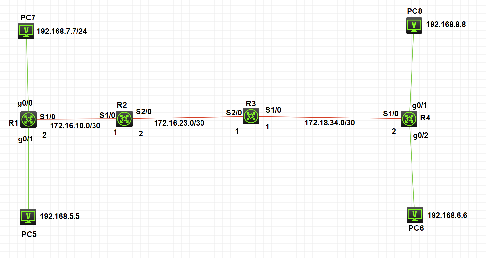
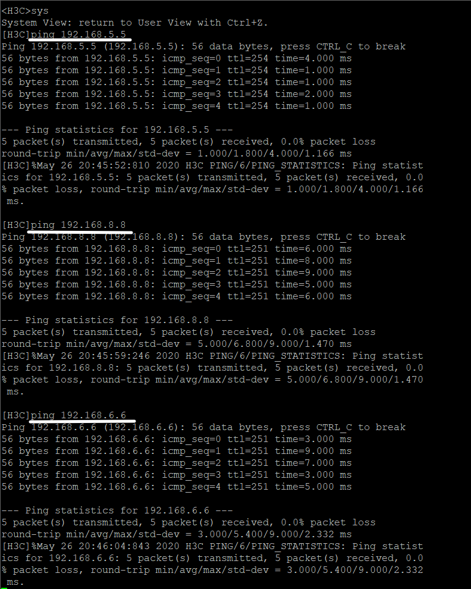

## 拓扑图




步骤：

1.  连线，路由器与路由器通过S端口连接
2.  配置好PC
3.  配置路由器端口IP
4.  配置路由器的下一跳地址（静态路由）


1.  连线情况可见拓扑图

2.  配置好PC

3.  端口IP

    R1

    ```
    [R1]int g0/0
    [R1-GigabitEthernet0/0]ip address 192.168.7.1 24
    [R1-GigabitEthernet0/0]undo shutdown
    [R1-GigabitEthernet0/0]quit
    [R1]int g0/1
    [R1-GigabitEthernet0/1]ip address 192.168.5.1 24
    [R1-GigabitEthernet0/1]undo shutdown
    [R1-GigabitEthernet0/1]quit
    [R1]int s1/0
    [R1-Serial1/0]ip add 172.16.10.2 30
    [R1-Serial1/0]undo shutdown
    [R1-Serial1/0]quit
    ```

    R2

    ```
    [H3C]sysname R2
    [R2]int s1/0
    [R2-Serial1/0]ip add 172.16.10.1 30
    [R2-Serial1/0]undo shutdown
    [R2-Serial1/0]quit
    [R2]int s2/0
    [R2-Serial2/0]ip add 172.16.23.2 30
    [R2-Serial2/0]undo shutdown
    [R2-Serial2/0]quit
    ```
    
    R3
    
    ```
    [H3C]sysname R3
    [R3]int s1/0
    [R3-Serial1/0]ip add 172.18.34.4 30
    Invalid IP address or subnet mask!
[R3-Serial1/0]ip add 172.18.34.1 30
    [R3-Serial1/0]undo shutdown
[R3-Serial1/0]quit
    [R3]int s2/0
    [R3-Serial2/0]ip add 172.16.23.1 30
    [R3-Serial2/0]undo shutdown
    [R3-Serial2/0]quit
    ```
    
    R4
    
    ```
    [H3C]sysname R4
    [R4]int s1/0
    [R4-Serial1/0]undo shutdown
    [R4-Serial1/0]ip add 172.18.34.2 30
[R4-Serial1/0]quit
    [R4]int g0/1
[R4-GigabitEthernet0/1]ip address 192.168.8.1 24
    [R4-GigabitEthernet0/1]undo shutdown
    [R4-GigabitEthernet0/1]quit
    [R4]int g0/2
    [R4-GigabitEthernet0/2]undo shutdown
    [R4-GigabitEthernet0/2]ip address 192.168.6.1 24
    [R4-GigabitEthernet0/2]quit
    ```
    
4.  配置静态路由

    R1 需要配置 到 PC8(192.168.8.8)  和  PC6(192.168.6.6)的路由

    ```
    [R1]ip rou
    [R1]ip route-static 192.168.6.6 24 172.16.10.1
    [R1]ip rou
    [R1]ip route-static 192.168.8.8 24 172.16.10.1
    ```
    
    R2  4台PC都需要配置
    
    ```
[R2]ip rou
    [R2]ip route-static 192.168.6.6 24 172.16.23.1
[R2]ip rou
    [R2]ip route-static 192.168.8.8 24 172.16.23.1
    [R2]ip rou
    [R2]ip route-static 192.168.7.7 24 172.16.10.2
    [R2]ip rou
    [R2]ip route-static 192.168.5.5 24 172.16.10.2
    ```
    
    R3 4台PC都需要配置
    
    ```
[R3]ip rou
    [R3]ip route-static 192.168.6.6 24 172.18.34.2
[R3]ip rou
    [R3]ip route-static 192.168.8.8 24 172.18.34.2
    [R3]ip rou
    [R3]ip route-static 192.168.7.7 24 172.16.23.2
    [R3]ip rou
    [R3]ip route-static 192.168.5.5 24 172.16.23.2
    ```
    
    R4 配置PC7(192.168.7.7)  和 PC5(192.168.5.5)
    
    ```
[R4]ip rou
    [R4]ip route-static 192.168.5.5 24 172.18.34.1
[R4]ip rou
    [R4]ip route-static 192.168.7.7 24 172.18.34.1
    ```


## ping 结果

PC7 

