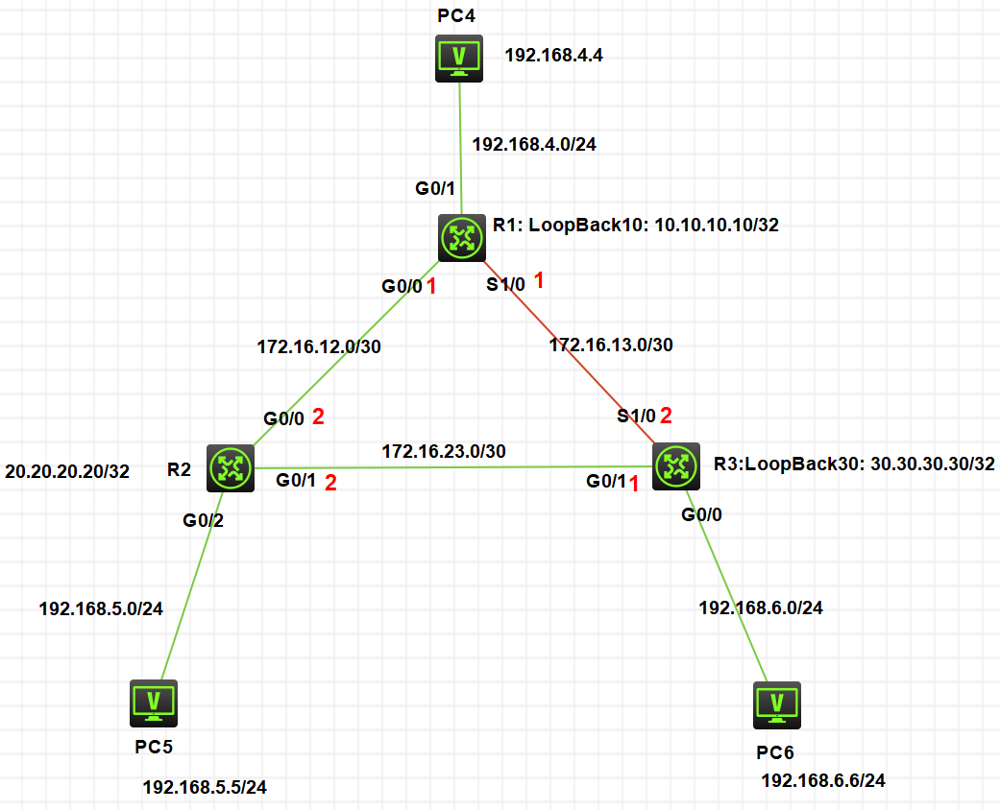
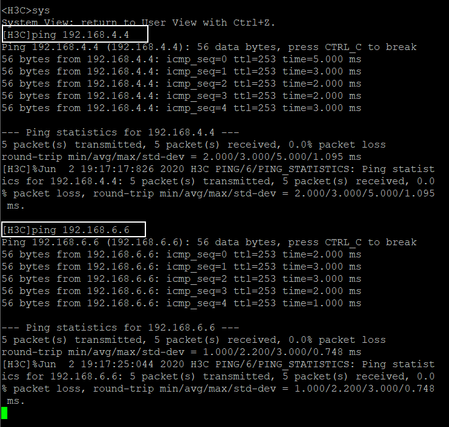

## 拓扑图




## R1配置

```
[R1]int g0/1
[R1-GigabitEthernet0/1]ip add 192.168.4.1 24
[R1-GigabitEthernet0/1]undo shutdown
[R1-GigabitEthernet0/1]quit
[R1]int g0/0
[R1-GigabitEthernet0/0]ip add 172.16.12.1 30
[R1-GigabitEthernet0/0]undo shutdown
[R1-GigabitEthernet0/0]quit
[R1]int s1/0
[R1-Serial1/0]ip add 172.16.13.1 30
[R1-Serial1/0]undo shutdown
[R1-Serial1/0]quit
[R1]int lo
[R1]int LoopBack 10
[R1-LoopBack1]ip add 10.10.10.10 32
[R1-LoopBack1]quit

[R1]ospf 1
[R1-ospf-1]area 0
[R1-ospf-1-area-0.0.0.0]network 192.168.4.0 0.0.0.255
[R1-ospf-1-area-0.0.0.0]network 172.16.12.0 0.0.0.3
[R1-ospf-1-area-0.0.0.0]network 172.16.13.0 0.0.0.3
[R1-ospf-1-area-0.0.0.0]network 10.10.10.10 0.0.0.0
[R1-ospf-1-area-0.0.0.0]quit
[R1-ospf-1]quit
```


## R2配置

```
[R2]int g0/0
[R2-GigabitEthernet0/0]ip add 172.16.12.2 30
[R2-GigabitEthernet0/0]undo shutdown
[R2-GigabitEthernet0/0]quit
[R2]int g0/1
[R2-GigabitEthernet0/1]ip add 172.16.23.2 30
[R2-GigabitEthernet0/1]undo shutdown
[R2-GigabitEthernet0/1]quit
[R2]int g0/2
[R2-GigabitEthernet0/2]ip add 192.168.5.1 24
[R2-GigabitEthernet0/2]undo shutdown
[R2-GigabitEthernet0/2]quit
[R2]int LoopBack 20
[R2-LoopBack1]ip add 20.20.20.20 32
[R2-LoopBack1]quit

[R2]ospf 2
[R2-ospf-2]area 0
[R2-ospf-2-area-0.0.0.0]network 172.16.12.0 0.0.0.3
[R2-ospf-2-area-0.0.0.0]network 172.16.23.0 0.0.0.3
[R2-ospf-2-area-0.0.0.0]network 192.168.5.0 0.0.0.255
[R2-ospf-2-area-0.0.0.0]network 20.20.20.20 0.0.0.0
[R2-ospf-2-area-0.0.0.0]quit
```


## R3配置

```
[R3]int s1/0
[R3-Serial1/0]ip add 172.16.13.2 30
[R3-Serial1/0]undo shutdown
[R3-Serial1/0]quit
[R3]int g0/1
[R3-GigabitEthernet0/1]ip add 172.16.23.1 30
[R3-GigabitEthernet0/1]undo shutdown
[R3-GigabitEthernet0/1]quit
[R3]int g0/0
[R3-GigabitEthernet0/0]ip add 192.168.6.1 24
[R3-GigabitEthernet0/0]undo shutdown
[R3-GigabitEthernet0/0]quit
[R3]int lo
[R3]int LoopBack 30
[R3-LoopBack30]ip add 30.30.30.30 32
[R3-LoopBack30]quit

[R3]ospf 3
[R3-ospf-3]area 0
[R3-ospf-3-area-0.0.0.0]network 172.16.23.0 0.0.0.3
[R3-ospf-3-area-0.0.0.0]network 192.168.6.0 0.0.0.255
[R3-ospf-3-area-0.0.0.0]network 172.16.13.0 0.0.0.3
[R3-ospf-3-area-0.0.0.0]network 30.30.30.30 0.0.0.0
[R3-ospf-3-area-0.0.0.0]quit
```


在配置OSPF过程中，路由器处于一个自主学习的状态，当双向建立广播（连接）时，会自动显示连接成功信息，类似这样

```
[R2-ospf-2-area-0.0.0.0]n%Jun  2 19:13:05:432 2020 R2 OSPF/5/OSPF_NBR_CHG: OSPF 2 Neighbor 172.16.12.1(GigabitEthernet0/0) changed from LOADING to FULL.
```


## PC5  ping PC4 PC6


