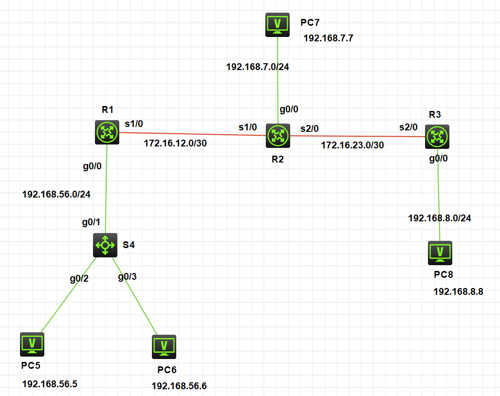
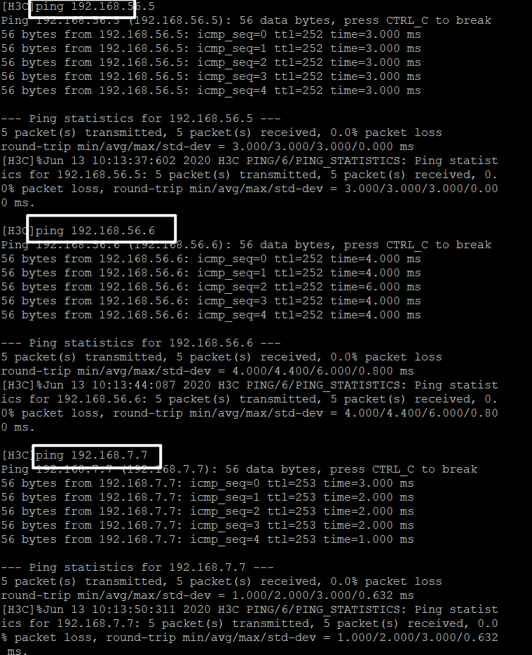
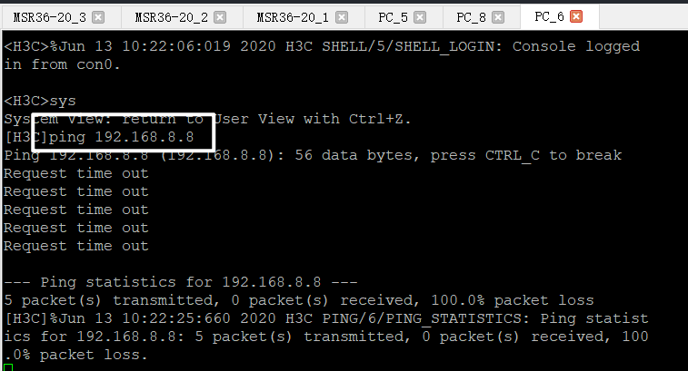
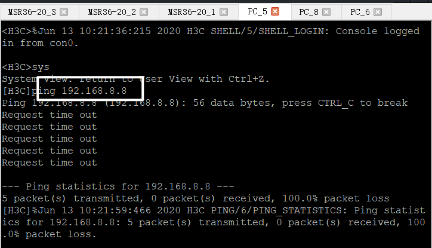
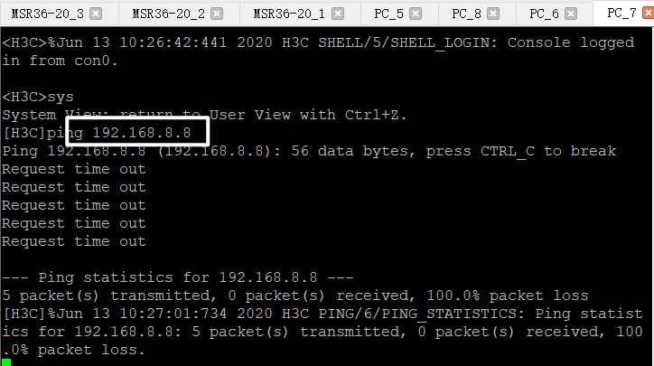

## 拓扑图



## R1配置

```
[H3C]sysname R1
[R1]int g0/0
[R1-GigabitEthernet0/0]ip add 192.168.56.1 24
[R1-GigabitEthernet0/0]undo shutdown
[R1-GigabitEthernet0/0]quit
[R1]int s1/0
[R1-Serial1/0]ip add 172.16.12.1 30
[R1-Serial1/0]undo shutdown
[R1-Serial1/0]quit

[R1]int lo
[R1]int LoopBack 10
[R1-LoopBack10]ip add 10.10.10.10 32
[R1-LoopBack10]quit

[R1]ospf 1
[R1-ospf-1]area 0
[R1-ospf-1-area-0.0.0.0]network 192.168.56.0 0.0.0.255
[R1-ospf-1-area-0.0.0.0]network 172.16.12.0 0.0.0.3
[R1-ospf-1-area-0.0.0.0]network 10.10.10.10 0.0.0.0
[R1-ospf-1-area-0.0.0.0]quit
[R1-ospf-1]quit
```

## R2配置

```
[H3C]sysname R2
[R2]int s1/0
[R2-Serial1/0]ip add 172.16.12.2 30
[R2-Serial1/0]undo shutdown
[R2-Serial1/0]quit
[R2]int g0/0
[R2-GigabitEthernet0/0]ip add 192.168.7.1 24
[R2-GigabitEthernet0/0]undo shutdown
[R2-GigabitEthernet0/0]quit
[R2]int s2/0
[R2-Serial2/0]ip add 172.16.23.2 30
[R2-Serial2/0]undo shutdown
[R2-Serial2/0]quit

[R2]int lo
[R2]int LoopBack 20
[R2-LoopBack20]ip add 20.20.20.20 32
[R2-LoopBack20]quit

[R2]ospf 2
[R2-ospf-2]area 0
[R2-ospf-2-area-0.0.0.0]network 172.16.12.0 0.0.0.3
[R2-ospf-2-area-0.0.0.0]%Jun 11 09:31:31:928 2020 R2 OSPF/5/OSPF_NBR_CHG: OSPF 2 Neighbor 172.16.12.1(Serial1/0) changed from LOADING to FULL.
[R2-ospf-2-area-0.0.0.0]network 192.168.7.0 0.0.0.255
[R2-ospf-2-area-0.0.0.0]network 20.20.20.20 0.0.0.0
[R2-ospf-2-area-0.0.0.0]network 172.16.23.0 0.0.0.3
[R2-ospf-2-area-0.0.0.0]quit
[R2-ospf-2]quit
[R2]%Jun 11 09:36:46:436 2020 R2 OSPF/5/OSPF_NBR_CHG: OSPF 2 Neighbor 172.16.23.1(Serial2/0) changed from LOADING to FULL.
%Jun 11 09:40:10:648 2020 R2 IFNET/5/LINK_UPDOWN: Line protocol state on the interface Serial2/0 changed to down.
%Jun 11 09:40:10:650 2020 R2 OSPF/5/OSPF_NBR_CHG: OSPF 2 Neighbor 172.16.23.1(Serial2/0) changed from FULL to DOWN.
```

## R3配置

```
[H3C]sysname R3
[R3]int g0/0
[R3-GigabitEthernet0/0]ip add 192.168.8.1 24
[R3-GigabitEthernet0/0]undo shutdown
[R3-GigabitEthernet0/0]quit
[R3]int s2/0
[R3-Serial2/0]ip add 172.16.23.1 30
[R3-Serial2/0]undo shutdown
[R3-Serial2/0]quit

[R3]int lo
[R3]int LoopBack 30
[R3-LoopBack30]ip add 30.30.30.30 32
[R3-LoopBack30]quit

[R3]ospf 3
[R3-ospf-3]area 0
[R3-ospf-3-area-0.0.0.0]network 192.168.9.0 0.0.0.255
[R3-ospf-3-area-0.0.0.0]network 172.16.23.0 0.0.0.3
[R3-ospf-3-area-0.0.0.0]%Jun 11 09:36:46:758 2020 R3 OSPF/5/OSPF_NBR_CHG: OSPF 3 Neighbor 172.16.23.2(Serial2/0) changed from LOADING to FULL.
[R3-ospf-3-area-0.0.0.0]network 30.30.30.30 0.0.0.0
[R3-ospf-3-area-0.0.0.0]quit
[R3-ospf-3]quit
```



## 配置ACL

禁止192.168.56.0/24 网段内的所有主机访问PC8

应该在与PC8直连的R3路由器上配置ACL，来阻止访问

```
[R3]acl basic 2000
[R3-acl-ipv4-basic-2000]rule deny source 192.168.56.0 0.0.0.255
[R3-acl-ipv4-basic-2000]quit
[R3]int s2/0
[R3-Serial2/0]packet-filter 2000 inbound
[R3-Serial2/0]quit
```





禁止PC7对目的主机PC8网段的FTP数据流

应该在与PC8直连的R3路由器上配置ACL，来阻止访问

```
[R3]acl basic 2000
[R3-acl-ipv4-basic-2000]rule deny source 192.168.7.7 0.0.0.255
[R3-acl-ipv4-basic-2000]quit
[R3]int s2/0
[R3-Serial2/0]packet-filter 2000 inbound
[R3-Serial2/0]quit
```

PC7 Ping PC8




