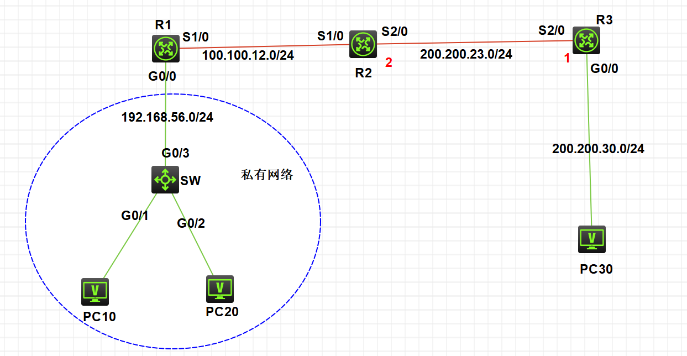
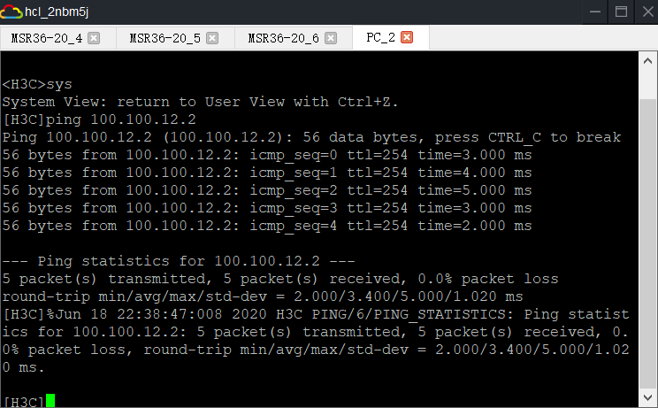

1.  允许所有私网PC机可以做NAT转换

    ```
    acl basic number
    rule 0 permit source 网段号 反掩码
    ```

2.  配置NAT地址池，设置地址池中用于地址转换的范围

    ```
    nat address-group number
    // group-number 地址组编号/地址此编号
    
    address Start IP address End IP address
    // Start IP address End IP address  公网地址
    ```

3.  将地址池与ACL关联，并在正确的接口的正确方向上下发

    ```
    interface 接口类型 接口名
    // 出方向动态地址转换配置在和外部网络连接的接口上
    
    nat outbound acl-number address-group group-number no-pat
    // nat outbound: 用来配置出方向动态地址的转换
    // no-pat
    // 表示使用 NO-PAT方式进行转换，即使按时不适用报文的端口信息
    // 如果未指定本参数，则表示使用PAT方式进行转换，即转换时使用报文的端口信息
    ```

4.  查看NAT表项

    ```
    display nat session verbose
    // 显示NAT会话的详细信息，即经过NAT地址转换处理的会话
    // NAT表项有一定的老化时间，一旦超时，NAT会删除表项
    ```


路由器配置

```
acl basic 2000
rule 10 permit source 私有网段  反掩码
// 查看ACL
dis alc all

// 创建NAT动态地址池
nat address-group 10   // 自动进入10地址池
address Start IP address End IP address  
// 设置地址池的范围，不可存在已分配地址 对私有网络IP进行转换

// 将acl 与 nat 进行关联
int s1/0
nat outbound 2000 address-group 10 no-pat
quit
```


## 拓扑图




先对路由器的端口进行配置

## R1

```
[H3C]sys R1
[R1]INT G0/0
[R1-GigabitEthernet0/0]ip address 192.168.56.1 24
[R1-GigabitEthernet0/0]undo shutdown
[R1-GigabitEthernet0/0]quit
[R1]int s1/0
[R1-Serial1/0]ip address 100.100.12.1 24
[R1-Serial1/0]undo shutdown
[R1-Serial1/0]quit
```

## R2

```
[H3C]sysname R2
[R2]int s1/0
[R2-Serial1/0]ip address 100.100.12.2 24
[R2-Serial1/0]undo shutdown
[R2-Serial1/0]quit
[R2]int s2/0
[R2-Serial2/0]ip address 200.200.23.2 24
[R2-Serial2/0]undo shutdown
[R2-Serial2/0]quit
```

## R3

```
[H3C]sysname R3
[R3]int s2/0
[R3-Serial2/0]ip address 200.200.23.1 24
[R3-Serial2/0]undo shutdown
[R3-Serial2/0]quit
[R3]int g0/0
[R3-GigabitEthernet0/0]ip address 200.200.30.1 24
[R3-GigabitEthernet0/0]undo shutdown
[R3-GigabitEthernet0/0]quit
```


分析：

这个实验与老师上课演示的有所不同

这里私有网络中的PC机要与目标PC取得联系的话

需要跨过两个网段（100.100.12.0       200.200.23.0）

也就是说，先让私有网络PC机与100.100.12.0网段可以ping通

然后再将100.100.12.0       200.200.23.0  建立联系


## NAT配置

需要在R1上进行配置

```
// 配置ACL
[R1]acl basic 2000
[R1-acl-ipv4-basic-2000]rule 10 permit source 192.168.56.1 0.0.0.255
[R1-acl-ipv4-basic-2000]quit

// 配置NAT
[R1]nat address-group 10
[R1-address-group-10]address 100.100.12.10 100.100.12.20
[R1-address-group-10]quit

// 将ACL 与 NAT 进行关联
[R1]int s1/0
[R1-Serial1/0]nat outbound 2000 address-group 10 no-pat
[R1-Serial1/0]quit
```

此时，私有网络与网段100.100.12.0  已经建立了连接

PC10 ping  R2的S1/0端口




然后需要 100.100.12.0       200.200.23.0 两个网段建立连接

连接方法我们学到了两种：静态路由    OSPF

这里采用OSPF方法

## OSPF配置

### R2配置

```
[R2]int lo
[R2]int LoopBack 20
[R2-LoopBack20]ip add 20.20.20.20 32
[R2-LoopBack20]quit

[R2]ospf 2
[R2-ospf-2]area 0
[R2-ospf-2-area-0.0.0.0]network 100.100.12.0 0.0.0.255
[R2-ospf-2-area-0.0.0.0]network 200.200.23.0 0.0.0.255
[R2-ospf-2-area-0.0.0.0]network 20.20.20.20 0.0.0.0
[R2-ospf-2-area-0.0.0.0]quit
[R2-ospf-2]quit
```

### R3配置

```
[R3]int lo
[R3]int LoopBack 30
[R3-LoopBack30]ip address 30.30.30.30 32
[R3-LoopBack30]quit

[R3]ospf 3
[R3-ospf-3]area 0
[R3-ospf-3-area-0.0.0.0]network 200.200.23.0 0.0.0.255
[R3-ospf-3-area-0.0.0.0]%Jun 18 22:57:06:680 2020 R3 OSPF/5/OSPF_NBR_CHG: OSPF 3 Neighbor 200.200.23.2(Serial2/0) changed from LOADING to FULL.

[R3-ospf-3-area-0.0.0.0]network 200.200.30.0 0.0.0.255
[R3-ospf-3-area-0.0.0.0]network 30.30.30.30 0.0.0.0
[R3-ospf-3-area-0.0.0.0]quit
[R3-ospf-3]quit
```

