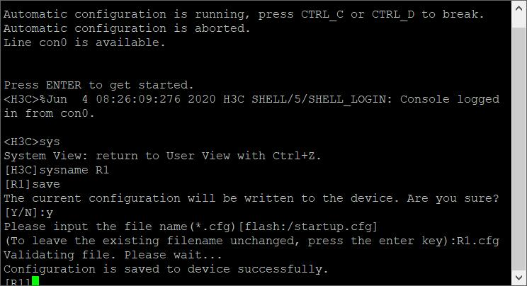

*   PC机要开启端口管理

*   保存配置（路由器，交换机），save, Y , R.cgf , 回车

    ```
    [R2]save
    The current configuration will be written to the device. Are you sure? [Y/N]:Y
    Please input the file name(*.cfg)[flash:/R2.cfg]
    (To leave the existing filename unchanged, press the enter key):R2.cfg
    flash:/R2.cfg exists, overwrite? [Y/N]:Y
    Validating file. Please wait...
    Configuration is saved to device successfully.
    ```

    

