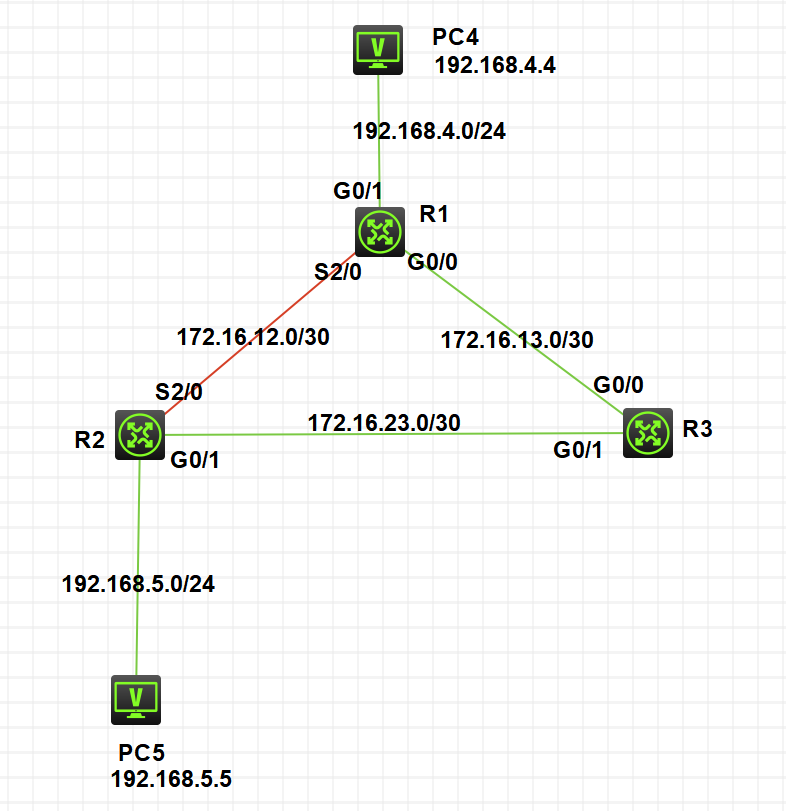

7。





R1配置

回环地址不需要undo shutdown

```

[R1]int g0/1
[R1-GigabitEthernet0/1]ip address 192.168.4.1 255.255.255.0
[R1-GigabitEthernet0/1]undo shutdown
[R1-GigabitEthernet0/1]quit
[R1]int g0/0
[R1-GigabitEthernet0/0]ip add 172.16.13.1 30
[R1-GigabitEthernet0/0]undo shutdown
[R1-GigabitEthernet0/0]quit
[R1]int s2/0
[R1-Serial2/0]ip add 182.16.12.1 30
[R1-Serial2/0]undo shutdown
[R1-Serial2/0]quit
[R1]int LoopBack 1
[R1-LoopBack1]ip add 1.1.1.1 32
[R1-LoopBack1]quit
```

查看R1配置

```
[R1]display ip interface brief
*down: administratively down
(s): spoofing  (l): loopback
Interface                Physical Protocol IP Address      Description
GE0/0                    up       up       172.16.13.1     --
GE0/1                    up       up       192.168.4.1     --
GE0/2                    down     down     --              --
GE5/0                    down     down     --              --
GE5/1                    down     down     --              --
GE6/0                    down     down     --              --
GE6/1                    down     down     --              --
Loop1                    up       up(s)    1.1.1.1         --
Ser1/0                   down     down     --              --
Ser2/0                   up       up       182.16.12.1     --
Ser3/0                   down     down     --              --
Ser4/0                   down     down     --              --
```


R2配置

```
[R2]int g0/0
[R2-GigabitEthernet0/0]ip add 192.168.5.1 24
[R2-GigabitEthernet0/0]undo shutdown
[R2-GigabitEthernet0/0]quit
[R2]int g0/1
[R2-GigabitEthernet0/1]ip add 172.16.23.2 30
[R2-GigabitEthernet0/1]undo shutdown
[R2-GigabitEthernet0/1]quit
[R2]int s2/0
[R2-Serial2/0]ip add 182.16.12.2 30
[R2-Serial2/0]undo shutdown
[R2-Serial2/0]quit
[R2]int LoopBack 2
[R2-LoopBack2]ip add 2.2.2.2 32
[R2-LoopBack2]quit
```


R3配置

```
[R3]int g0/0
[R3-GigabitEthernet0/0]ip add 172.16.13.2 30
[R3-GigabitEthernet0/0]undo shutdown
[R3-GigabitEthernet0/0]quit
[R3]int g0/1
[R3-GigabitEthernet0/1]ip add 172.16.23.1 30
[R3-GigabitEthernet0/1]undo shutdown
[R3-GigabitEthernet0/1]quit
[R3]int lo
[R3]int LoopBack 3
[R3-LoopBack3]ip add 3.3.3.3 32
[R3-LoopBack3]quit
```


配置OSPF，将网段广播出去

ospf 号自定义即可    area 区域号需要相同(因为在一个区域)

格式为：

```
network 网段号 反掩码
```

R1

```
[R1]ospf 1
[R1-ospf-1]area 0
[R1-ospf-1-area-0.0.0.0]network 192.168.4.0 0.0.0.255
[R1-ospf-1-area-0.0.0.0]network 172.16.12.0 0.0.0.3
[R1-ospf-1-area-0.0.0.0]network 172.16.13.0 0.0.0.3
[R1-ospf-1-area-0.0.0.0]network 1.1.1.1 0.0.0.0
```

R2

```
[R2]ospf 2
[R2-ospf-2]area 0
[R2-ospf-2-area-0.0.0.0]network 172.16.12.0 0.0.0.3
[R2-ospf-2-area-0.0.0.0]network 172.16.23.0 0.0.0.3
[R2-ospf-2-area-0.0.0.0]network 192.168.5.0 0.0.0.255
```

